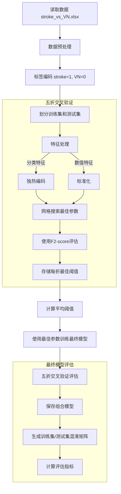

## 数据来源和分布


该数据收录了总共235名具有影像学金标准的急性眩晕患者，按照症状分为前庭炎患者和中风患者，同时所有纳入患者均接受了头部冲击试验（HIT）、自发眼震试验、凝视诱发眼震试验，并进行了站立能力评估。这三项试验被叫做STANDING流程，是近些年来新提出的临床检测中枢性急性眩晕的结构化算法，在一些研究中表现出较高的灵敏度[1]。


<center>Fig 1. 患者诊断结果分布</center>


235例急性眩晕患者中，前庭炎占比192例(81.7%)，脑卒中占比43例(18.3%)。

## 使用STANDING流程对235例患者进行外周性或中枢性检测


### STANDING流程


<center>Fig 2. STANDIN流程图，根据我们数据的改版</center>

根据STANDING流程我们设计了针对我们数据来源的STANDING流程改版，首先，进行眼震检查，分为两个项目，SN（Spontaneous Nystagmus 自发性眼震）和GEN（Gaze-evoked Nystagmus 凝视诱发性眼震）;可以得到的眼震模式分为 H-SN，UD-GEN，V-SN，D-GEN或者没有眼震（Absent）；
这些眼震模式的含义如下所示：

* H: Horizonal 水平方向
* V: Vertical 垂直方向
* D: Direction 方向性 (眼震的快相方向与注视方向一致，注视向右时，眼震的快相向右；注视向左时，眼震的快相向左)
* UD: Uni-Direction 单一方向性 (凝视性眼震中，眼震快相方向与注视方向无关，保持一致)

其中H-SN和UD-GEN眼震模式可能是由于外周性或中枢性原因导致，需要通过头脉冲试验进一步确认；如果头脉冲试验阳性则表明患者由于外周性原因导致的眩晕，常常因为前庭炎，头脉冲阴性则指向中枢性眩晕原因，通常为中风。

如果出现V-SN或D-GEN模式，则患者大概率为中枢性眩晕；

没有眼震的患者需要进行站立评估，如果共济失调评估等级在2级以上，则指向中枢性眩晕原因

### 眼震模式分布


<center>Fig 3. 眼震模式分布</center>


<center>Fig 4. 不同眼震模式下</center>


按照眼震模式区分，235例患者大部分表现为水平性自发性眼震和单一方向性的凝视性眼震。可以看到按照流程走，在眼震模式下具备中枢性特征的D-GEN，V-SN都被检测到卒中，敏感度达到100%。STANDING流程主要在眼震模式在H-SN和UD-GEN这两个占最多数情况的病例中，在头脉冲试验表现出阳性的情况下表达出误判的情况。


<center>Fig 5. 传统STANDING方法分类结果混淆矩阵</center>


通过传统的Standing流程，有12例脑卒中病人最终被漏判为前庭炎，有4例前庭炎患者被错判为脑卒中，接下来哦我们通过机器学习方法得到的模型将重点关注传统Standing流程错误的部分，从机器学习模型的分析中帮助我们对传统Standing流程基于关键参数的量化指标进行提升。

## 使用传统机器学习模型对235例患者进行分类


### 相对于传统STANDING流程增加的四个数值量化特征


我们主要关注的机器学习算法是随机森林，它是类似于STANDING流程通过bagging和特征随机化技术构建多颗决策树的进行分类的算法。相较于传统STANDING流程，我们还会利用到一些量化数值特征，这些特征包括，

* 眼震试验慢相速度最大值 (1)
* 头脉冲试验病侧增益 (2)
* 头脉冲试验健侧和病侧增益差 (3)
* 头脉冲试验病侧和健侧增益比 (4)


### 训练过程


<center>Fig 6. 机器学习训练过程，对于种类特征和数值特征的处理；如何设置超参和寻找最佳阈值</center>

对于类别参数，我们会采取独立热编码，将特征分为多个0、1特征，如VOG_Nystagmus_pattern特征有7个选项，最终特征会变为

- VOG_nystagmus_pattern_H-GEN
- VOG_nystagmus_pattern_D-GEN
- VOG_nystagmus_pattern_H-SN┋T-SN
- VOG_nystagmus_pattern_V-SN┋D-GEN
- VOG_nystagmus_pattern_UD-GEN
- ... ....

对于数值特征，则会进行标准化。


我们的训练过程中，通过五折交叉验证和网格搜索寻找性能和泛化能力最优的超参数和阈值，以随机森林的超参数搜索范围如下：

```
n_estimators: [100, 150, 200, 250, 300, 350, 400, 450, 500]
max_depth: [3, 4, 5, 6, 7, 8]
max_samples: [0.5, 0.6, 0.7, 0.8, 0.9, 1.0]
```

n_estimators - 树的数量
max_depth: - 树的深度
max_samples - bagging的比例

我们会遍历所有上述超参训练出来的情况以得到最佳的训练超参数。

搜索的评估的目标函数设置为$F_{beta}$ Score，

$$
F_{\beta} = (1 + \beta^2) \cdot \frac{\text{precision}\cdot \text{recall}}{(\beta^2 \cdot \text{precision}) + \text{recall}}
$$
$F_{\beta}$ 指标用来在不平衡数据集中平衡精确度和召回率之间的权重，因为我们的任务更在意能否将脑卒中病人找到，因此对于召回率的要求更高，在这里将$\beta$设置为2。

找到最佳超参数与阈值后，我们最后再使用五折交叉验证来得到模型的分类结果。

### 模型结果分析


最终，通过超参网格搜索和阈值检索，我们得到随机森林的最佳超参为100棵树，3层树深度和50% bagging比例。 

得到的最后分类结果如下：


<center>Fig 7. Random Forest方法分类结果混淆矩阵</center>


<center>Fig 8. MLP方法分类结果混淆矩阵</center>


<center>Fig 9. SVM方法分类结果混淆矩阵</center>

<center>Table 1. 三个模型分类结果评估参数对比</center>

| 模型            | 数据集 | Precision | Recall | F1-score | Accuracy |
| :------------ | :-: | :-------: | :----: | :------: | :------: |
| Random Forest | 训练集 |   0.76    |  0.87  |   0.81   |   0.93   |
|               | 测试集 |   0.66    |  0.77  |   0.71   |   0.89   |
| SVM           | 训练集 |   0.56    |  0.81  |   0.66   |   0.85   |
|               | 测试集 |   0.53    |  0.79  |   0.64   |   0.83   |
| MLP           | 训练集 |   0.42    |  0.58  |   0.49   |   0.77   |
|               | 测试集 |   0.44    |  0.70  |   0.54   |   0.78   |


<center>Fig 10. 模型ROC曲线对比</center>


<center>Fig 11. 模型PR曲线对比</center>


从AUC曲线和PR曲线来看，Random Forest在这个任务中分类性能是优于SVM和MLP的，尤其从PR曲线来看，SVM在保证较高敏感度的情况下损失较小的精准度。因此我们接下来讨论的重点会放在随机森林算法对于STANDING流程的改进。

## 随机森林算法指导STANDING流程改进


### 随机森林算法和STANDING流程分类效果对比


<center>Fig 12. 传统STANDING流程分类和随机森林分类对比；从左到右 - 传统STANDING流程分类结果混淆矩阵，随机森林分类方法混淆矩阵，二者分类效果指标对比，McNemar检测二者是否有本质差别</center>


从分类指标来看，随机森林算法在牺牲一定特异性和精确度的情况下提升了对脑卒中患者的敏感度，二者在McNemar检测中没有表现出差异。

### 关注于假阳性患者


## Reference

[1] Vanni, S., et al. “STANDING, a Four-Step Bedside Algorithm for Differential Diagnosis of Acute Vertigo in the Emergency Department.” _Acta Otorhinolaryngologica Italica: Organo Ufficiale Della Societa Italiana Di Otorinolaringologia E Chirurgia Cervico-Facciale_, vol. 34, no. 6, Dec. 2014, pp. 419–26.

