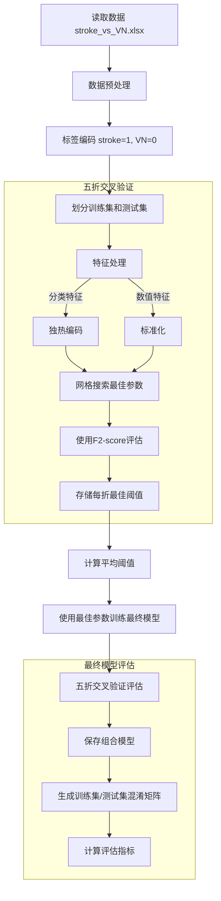

## 数据来源和分布


该数据收录了总共235名具有影像学金标准的急性眩晕患者，按照症状分为前庭炎患者和中风患者，同时所有纳入患者均接受了头部冲击试验（HIT）、自发眼震试验、凝视诱发眼震试验，并进行了站立能力评估。这三项试验被叫做STANDING流程，是近些年来新提出的临床检测中枢性急性眩晕的结构化算法，在一些研究中表现出较高的灵敏度[1]。


<center>Fig 1. 患者诊断结果分布</center>


235例急性眩晕患者中，前庭炎占比192例(81.7%)，脑卒中占比43例(18.3%)。

## 使用STANDING流程对235例患者进行外周性或中枢性检测


### STANDING流程


<center>Fig 2. STANDIN流程图，根据我们数据的改版</center>

根据STANDING流程我们设计了针对我们数据来源的STANDING流程改版，首先，进行眼震检查，分为两个项目，SN（Spontaneous Nystagmus 自发性眼震）和GEN（Gaze-evoked Nystagmus 凝视诱发性眼震）;可以得到的眼震模式分为 H-SN，UD-GEN，V-SN，D-GEN或者没有眼震（Absent）；
这些眼震模式的含义如下所示：

* H: Horizonal 水平方向
* V: Vertical 垂直方向
* D: Direction 方向性 (眼震的快相方向与注视方向一致，注视向右时，眼震的快相向右；注视向左时，眼震的快相向左)
* UD: Uni-Direction 单一方向性 (凝视性眼震中，眼震快相方向与注视方向无关，保持一致)

其中H-SN和UD-GEN眼震模式可能是由于外周性或中枢性原因导致，需要通过头脉冲试验进一步确认；如果头脉冲试验阳性则表明患者由于外周性原因导致的眩晕，常常因为前庭炎，头脉冲阴性则指向中枢性眩晕原因，通常为中风。

如果出现V-SN或D-GEN模式，则患者大概率为中枢性眩晕；

没有眼震的患者需要进行站立评估，如果共济失调评估等级在2级以上，则指向中枢性眩晕原因

### 眼震模式分布


<center>Fig 3. 眼震模式分布</center>


<center>Fig 4. 不同眼震模式下</center>


按照眼震模式区分，235例患者大部分表现为水平性自发性眼震和单一方向性的凝视性眼震。可以看到按照流程走，在眼震模式下具备中枢性特征的D-GEN，V-SN都被检测到卒中，敏感度达到100%。STANDING流程主要在眼震模式在H-SN和UD-GEN这两个占最多数情况的病例中，在头脉冲试验表现出阳性的情况下表达出误判的情况。


<center>Fig 5. 传统STANDING方法分类结果混淆矩阵</center>


通过传统的Standing流程，有12例脑卒中病人最终被漏判为前庭炎，有4例前庭炎患者被错判为脑卒中，接下来哦我们通过机器学习方法得到的模型将重点关注传统Standing流程错误的部分，从机器学习模型的分析中帮助我们对传统Standing流程基于关键参数的量化指标进行提升。

## 使用传统机器学习模型对235例患者进行分类


### 相对于传统STANDING流程增加的四个数值量化特征


我们主要关注的机器学习算法是随机森林，它是类似于STANDING流程通过bagging和特征随机化技术构建多颗决策树的进行分类的算法。相较于传统STANDING流程，我们还会利用到一些量化数值特征，这些特征包括，

* 眼震试验慢相速度最大值 (1)
* 头脉冲试验病侧增益 (2)
* 头脉冲试验健侧和病侧增益差 (3)
* 头脉冲试验病侧和健侧增益比 (4)


### 训练过程


<center>Fig 6. 机器学习训练过程，对于种类特征和数值特征的处理；如何设置超参和寻找最佳阈值</center>

对于类别参数，我们会采取独立热编码，将特征分为多个0、1特征，如VOG_Nystagmus_pattern特征有7个选项，最终特征会变为

- VOG_nystagmus_pattern_H-GEN
- VOG_nystagmus_pattern_D-GEN
- VOG_nystagmus_pattern_H-SN┋T-SN
- VOG_nystagmus_pattern_V-SN┋D-GEN
- VOG_nystagmus_pattern_UD-GEN
- ... ....

对于数值特征，则会进行标准化。


我们的训练过程中，通过五折交叉验证和网格搜索寻找性能和泛化能力最优的超参数和阈值，以随机森林的超参数搜索范围如下：

```
n_estimators: [100, 150, 200, 250, 300, 350, 400, 450, 500]
max_depth: [3, 4, 5, 6, 7, 8]
max_samples: [0.5, 0.6, 0.7, 0.8, 0.9, 1.0]
```

n_estimators - 树的数量
max_depth: - 树的深度
max_samples - bagging的比例

我们会遍历所有上述超参训练出来的情况以得到最佳的训练超参数。

搜索的评估的目标函数设置为$F_{beta}$ Score，

$$
F_{\beta} = (1 + \beta^2) \cdot \frac{\text{precision}\cdot \text{recall}}{(\beta^2 \cdot \text{precision}) + \text{recall}}
$$
$F_{\beta}$ 指标用来在不平衡数据集中平衡精确度和召回率之间的权重，因为我们的任务更在意能否将脑卒中病人找到，因此对于召回率的要求更高，在这里将$\beta$设置为2。

找到最佳超参数与阈值后，我们最后再使用五折交叉验证来得到模型的分类结果。

### 模型结果分析


最终，通过超参网格搜索和阈值检索，我们得到随机森林的最佳超参为100棵树，3层树深度和50% bagging比例。 

得到的最后分类结果如下：


<center>Fig 7. Random Forest方法分类结果混淆矩阵</center>


<center>Fig 8. MLP方法分类结果混淆矩阵</center>


<center>Fig 9. SVM方法分类结果混淆矩阵</center>


<center>Table 1. 三个模型分类结果评估参数对比</center>

| 模型            | 数据集 | Precision | Recall | F1-score | Accuracy |
| :------------ | :-: | :-------: | :----: | :------: | :------: |
| Random Forest | 训练集 |   0.76    |  0.87  |   0.81   |   0.93   |
|               | 测试集 |   0.66    |  0.77  |   0.71   |   0.89   |
| SVM           | 训练集 |   0.56    |  0.81  |   0.66   |   0.85   |
|               | 测试集 |   0.53    |  0.79  |   0.64   |   0.83   |
| MLP           | 训练集 |   0.42    |  0.58  |   0.49   |   0.77   |
|               | 测试集 |   0.44    |  0.70  |   0.54   |   0.78   |


<center>Fig 10. 模型ROC曲线对比</center>


<center>Fig 11. 模型PR曲线对比</center>


从AUC曲线和PR曲线来看，Random Forest在这个任务中分类性能是优于SVM和MLP的，尤其从PR曲线来看，SVM在保证较高敏感度的情况下损失较小的精准度。因此我们接下来讨论的重点会放在随机森林算法对于STANDING流程的改进。

## 随机森林算法指导STANDING流程改进


### 随机森林算法和STANDING流程分类效果对比


<center>Fig 12. 传统STANDING流程分类和随机森林分类对比；从左到右 - 传统STANDING流程分类结果混淆矩阵，随机森林分类方法混淆矩阵，二者分类效果指标对比，McNemar检测二者是否有本质差别</center>


从分类指标来看，随机森林算法在牺牲一定特异性和精确度的情况下提升了对脑卒中患者的敏感度，二者在McNemar检测中没有表现出差异。

### 关注STANDING流程中漏判的脑卒中患者


在孤立性头晕患者中准确筛查出有着高危风险的脑卒中患者非常重要，因此我们主要关注STANDING流程中漏判的脑卒中患者，一共是12例，它们的特征如下：

<center>Table 2. 在STANDING流程中被误判的12例脑卒中患者中有6例在随机森林中被判对</center>

| Patient_ID | True_Diagnosis | Traditional_Prediction | RF_Prediction | RF_Probability | VOG_nystagmus_pattern | VOG_nystagmus_SPVmax | Video_HIT_result | Video_HIT_gain_weak_side | Truncal_ataxia | Video_HIT_gain_strongSide_minus_weakSide | Video_HIT_gain_weakSide_2_strongSide |
| ---------- | -------------- | ---------------------- | ------------- | -------------- | --------------------- | -------------------- | ---------------- | ------------------------ | -------------- | ---------------------------------------- | ------------------------------------ |
| 28         | stroke         | VN                     | stroke        | 0.271749       | UD-GEN                | 3                    | positive         | 0.27                     | 0              | 0.26                                     | 0.509434                             |
| 96         | stroke         | VN                     | stroke        | 0.325389       | H-SN                  | 10                   | positive         | 0.79                     | 3              | 0.18                                     | 0.814433                             |
| 109        | stroke         | VN                     | stroke        | 0.185681       | H-SN                  | 4                    | positive         | 0.57                     | 3              | 0.18                                     | 0.76                                 |
| 145        | stroke         | VN                     | stroke        | 0.407919       | H-SN                  | 7                    | positive         | 0.75                     | 3              | 0.07                                     | 0.914634                             |
| 201        | stroke         | VN                     | stroke        | 0.234167       | H-SN                  | 20                   | positive         | 0.19                     | 1              | 1.06                                     | 0.152                                |
| 216        | stroke         | VN                     | stroke        | 0.35205        | H-SN                  | 3                    | positive         | 0.77                     | 3              | 0.12                                     | 0.865169                             |
| 0          | stroke         | VN                     | VN            | 0.083606       | H-SN                  | 7                    | positive         | 0.33                     | 3              | 0.4                                      | 0.452055                             |
| 20         | stroke         | VN                     | VN            | 0.049667       | H-SN                  | 5                    | positive         | 0.51                     | 0              | 0.41                                     | 0.554348                             |
| 77         | stroke         | VN                     | VN            | 0.049819       | H-SN                  | 8                    | positive         | 0.61                     | 3              | 0.59                                     | 0.508333                             |
| 95         | stroke         | VN                     | VN            | 0.047378       | H-SN                  | 10                   | positive         | 0.56                     | 2              | 0.31                                     | 0.643678                             |
| 156        | stroke         | VN                     | VN            | 0.065717       | H-SN                  | 7                    | positive         | 0.41                     | 3              | 0.39                                     | 0.5125                               |
| 217        | stroke         | VN                     | VN            | 0.151561       | H-SN                  | 4                    | positive         | 0.49                     | 3              | 0.21                                     | 0.7                                  |


被分错的数据表现为眼震模式为H-SN 11例，UD-GEN 1例；头脉冲试验为阳性，在STANDING流程中被误判为前庭炎症。

在加入特征：

* 眼震试验慢相速度最大值 (1)
* 头脉冲试验病侧增益 (2)
* 头脉冲试验健侧和病侧增益差 (3)
* 头脉冲试验病侧和健侧增益比 (4)

这四个量化特征后，我们可以将错判的12例患者中的6例正确判读，那么在随机森林中，这6个特征被正确判断正确的原因是什么呢？我们通过SHAP分析来观察特征在随机森林算法中的权重。


<center>Fig 13. 随机森林特征SHAP分析Beeswarm图</center>

由于使用了独立热编码处理种类特征后，每个类别都会被转换为一个独立的二进制特征，并且每个这样的二进制特征都会有一个对应的SHAP值，如上图所示，我们可以合并这些独立二进制特征来表达原始种类特征的贡献，合并后并进行归一化的特征重要性分类图如图：


<center>Fig 14. 特征重要性排序</center>


<center>Table 3. 特征重要性排序</center>

| feature                                  | importance | importance_normalized |
| ---------------------------------------- | ---------- | --------------------- |
| Video_HIT_result                         | 0.0904     | 0.43                  |
| Video_HIT_gain_weak_side                 | 0.0421     | 0.2                   |
| Video_HIT_gain_weakSide_2_strongSide     | 0.0207     | 0.0983                |
| Video_HIT_gain_strongSide_minus_weakSide | 0.0196     | 0.0931                |
| VOG_nystagmus_pattern                    | 0.0168     | 0.0798                |
| VOG_nystagmus_SPVmax                     | 0.0118     | 0.056                 |
| Truncal_ataxia                           | 0.009      | 0.0428                |

头脉冲相关参数在模型里显示出了极为强势的重要性占比，重要性占比达到70%以上。

紧接着我们通过固定眼震模式为H-SN，头脉冲试验结果为阳性，眼震慢相速度为10，共济失调等级为1，去研究**头脉冲增益相关的三个数值量化特征**对于结果的具体影响。

我们通过绘制这三个特征的二联特征表。二联特征表是一种2D热力图，由于我们每次只能显示其中两个变量的关系，但第三个变量的值也会影响预测结果，所以当我们画两个变量的热力图时，实际上是对第三个变量取了平均值，即


$$
热力图(x,y) = 平均值[预测概率(x,y,z)] 
$$

我们对Video_HIT_gain_weak_side， Video_HIT_gain_weakSide_2_strongSide， Video_HIT_gain_strongSide_minus_weakSide三个特征的二联特征表分析结果如下：


<center>Fig 15. 头脉冲试验弱侧增益、头脉冲试验健侧增益与病侧增益差、头脉冲试验病侧增益和健侧增益比、三个特征两两对应的二联特征热力图，左侧为脑卒中概率预测，右侧为模型最终根据概率和阈值给出的分类结果</center>


从Fig15来看，我们可以看到这三个特征在0.24-0.72之间模型表现出倾向于判断为前庭问题，小于0.24和大于0.72则表现出中枢问题，即脑卒中。

增益过大但是因为扫视波原因被判断为头脉冲试验结果为阳性导致的误判是可以被改进的，目前的多项研究[2],[3]表明，扫视波并不能直接用于判断头脉冲试验结果阳性与否，头脉冲试验结果要用增益值来判断，目前市面上判断不正常增益的阈值在0.7-0.8[2]之间。文献的结论和随机森林模型得到的结果吻合，这个将帮助我们更改我们使用手机判断头脉冲结果的判断依据。

<center>Table 3. 随机森林判断为脑卒中，实际诊断结果为前庭炎</center>

| Patient_ID | True_Diagnosis | Traditional_Prediction | RF_Prediction | RF_Probability | VOG_nystagmus_pattern | VOG_nystagmus_SPVmax | Video_HIT_result | Video_HIT_gain_weak_side | Truncal_ataxia | Video_HIT_gain_strongSide_minus_weakSide | Video_HIT_gain_weakSide_2_strongSide |
| ---------- | -------------- | ---------------------- | ------------- | -------------- | --------------------- | -------------------- | ---------------- | ------------------------ | -------------- | ---------------------------------------- | ------------------------------------ |
| 63         | VN             | stroke                 | stroke        | 0.649107       | H-SN                  | 15                   | negative         | 0.86                     | 0              | 0.23                                     | 0.788991                             |
| 26         | VN             | stroke                 | stroke        | 0.38935        | H-SN                  | 3                    | negative         | 0.63                     | 2              | 0.28                                     | 0.692308                             |
| 14         | VN             | VN                     | stroke        | 0.348464       | H-SN                  | 6                    | positive         | 0.68                     | 3              | 0.08                                     | 0.894737                             |
| 168        | VN             | VN                     | stroke        | 0.332392       | H-SN                  | 3                    | positive         | 0.67                     | 3              | 0.1                                      | 0.87013                              |
| 101        | VN             | VN                     | stroke        | 0.287169       | H-SN                  | 4                    | positive         | 0.78                     | 1              | 0.12                                     | 0.866667                             |
| 179        | VN             | VN                     | stroke        | 0.253644       | H-SN                  | 3                    | positive         | 0.19                     | 0              | 0.04                                     | 0.826087                             |
| 194        | VN             | VN                     | stroke        | 0.23851        | H-SN                  | 8                    | positive         | 0.77                     | 3              | 0.13                                     | 0.855556                             |
| 117        | VN             | VN                     | stroke        | 0.214893       | H-SN                  | 7                    | positive         | 0.79                     | 3              | 0.24                                     | 0.76699                              |
| 51         | VN             | VN                     | stroke        | 0.186245       | UD-GEN                | 5                    | positive         | 0.78                     | 1              | 0.4                                      | 0.661017                             |
| 85         | VN             | VN                     | stroke        | 0.183854       | H-SN                  | 6                    | positive         | 0.16                     | 0              | 0.99                                     | 0.13913                              |

从Table3中，我们发现，过低的头脉冲增益在模型中也被认为是高危卒中的标志，但这个结论并不完全正确，会导致一定比例的将前庭炎患者误判为脑卒中，但是总体而言会提升模型对于卒中的敏感度。

考虑到头脉冲试验健侧增益与病侧增益差这个特征，一些研究发现[4]这个特征在不同的急性眩晕病因中有着显著
差异，其中Qiongfeng Guan发现这个特征可以用来区分前庭神经炎（VN）和良性发作性位置性眩晕（BPPV）。

我们参考Qiongfeng Guan的方法也对我们的数据组，前庭神经炎（VN）和脑卒中（Stroke）组的这两个特征进行显著性检测，结果如下：


<center>Fig 16. 前庭神经炎（VN）和脑卒中（Stroke）“头脉冲试验弱侧增益”、“头脉冲试验健侧增益与病侧增益差”和“头脉冲试验病侧增益和健侧增益比” 特征分布</center>


<center>Table 4. 前庭神经炎（VN）和脑卒中（Stroke）“头脉冲试验健侧增益与病侧增益差”和“头脉冲试验病侧增益和健侧增益比” 特征均值和方差，以及显著性差异结果 </center>


| Feature                                  | VN_Mean_SD    | Stroke_Mean_SD | Test_Method         | P_value |
| ---------------------------------------- | ------------- | -------------- | ------------------- | ------- |
| Video_HIT_gain_weak_side                 | 0.519 ± 0.151 | 0.830 ± 0.296  | Student's t-test    | 0.0000  |
| Video_HIT_gain_weakSide_2_strongSide     | 0.536 ± 0.145 | 0.787 ± 0.197  | Mann-Whitney U test | 0.0000  |
| Video_HIT_gain_strongSide_minus_weakSide | 0.456 ± 0.162 | 0.208 ± 0.200  | Mann-Whitney U test | 0.0000  |

通过Fig 16和Table4可以看出，使用这两个特征进行分类的结论是有统计学意义支撑的，二者在这两个特征值的分布上有着显著性差异。


同时，因为这三个特征之间具有相关性，我们希望同时比较多个相关变量在不同组间的差异以及发现可能在单变量分析中被忽略的组间差异模式，我们会采集MANOVA（Multivariate Analysis of Variance，多变量方差分析）方法来分析这三个特征。

因此我们修改传统STANDING流程在最后判断外周病因时增加对于增益差和增益比异常的警告来改善传统模型的判断敏感度，更改后的STANDING流程如下图所示：


<center>Fig 17. 通过头脉冲增益特征改善STANDING流程</center>

## 结论


通过对235例病人STANDING流程中的眼震试验相关特征，头脉冲试验相关特征和站立姿态特征的研究，我们使用了随机森林模型，利用这些试验中可以得到量化的数值特征对流程进行了提升，发现了头脉冲增益对于判断的潜在重要性，通过设置对于头脉冲试验弱侧增益、头脉冲试验健侧增益与病侧增益差、头脉冲试验病侧增益和健侧增益比这三个特征的阈值判断，可以有效将原有的STANDING流程的敏感度提升15%。该研究得到了统计学支持和泛化性测试，说明这三个特征的组合确实能够帮助区分VN和Stroke患者。


## Reference

[1] Vanni, S., et al. “STANDING, a Four-Step Bedside Algorithm for Differential Diagnosis of Acute Vertigo in the Emergency Department.” _Acta Otorhinolaryngologica Italica: Organo Ufficiale Della Societa Italiana Di Otorinolaringologia E Chirurgia Cervico-Facciale_, vol. 34, no. 6, Dec. 2014, pp. 419–26.

[2] Alhabib, Salman F., and Issam Saliba. “Video Head Impulse Test: A Review of the Literature.” _European Archives of Oto-Rhino-Laryngology_, vol. 274, no. 3, Mar. 2017, pp. 1215–22. _DOI.org (Crossref)_, https://doi.org/10.1007/s00405-016-4157-4.

[3] Lee, Dong-Han, et al. “Objective Measurement of HINTS (Head Impulse, Nystagmus, Test of Skew) in Peripheral Vestibulopathy.” _Auris Nasus Larynx_, vol. 49, no. 6, Dec. 2022, pp. 938–49. _DOI.org (Crossref)_, https://doi.org/10.1016/j.anl.2022.03.003.

[4] Guan, Qiongfeng, et al. “[Video head impulse test for evaluation of vestibular function in patients with vestibular neuritis and benign paroxysmal positional vertigo].” _Zhejiang Da Xue Xue Bao. Yi Xue Ban = Journal of Zhejiang University. Medical Sciences_, vol. 46, no. 1, Jan. 2017, pp. 52–58. _PubMed_, https://doi.org/10.3785/j.issn.1008-9292.2017.02.08.